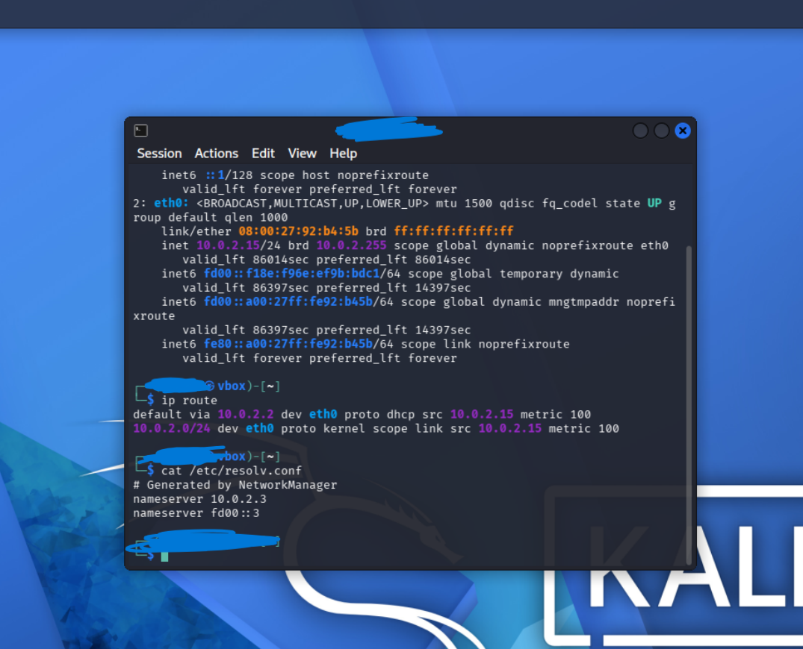
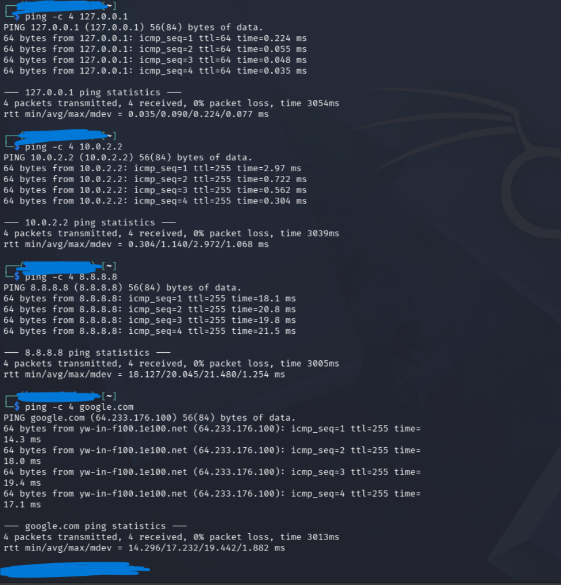
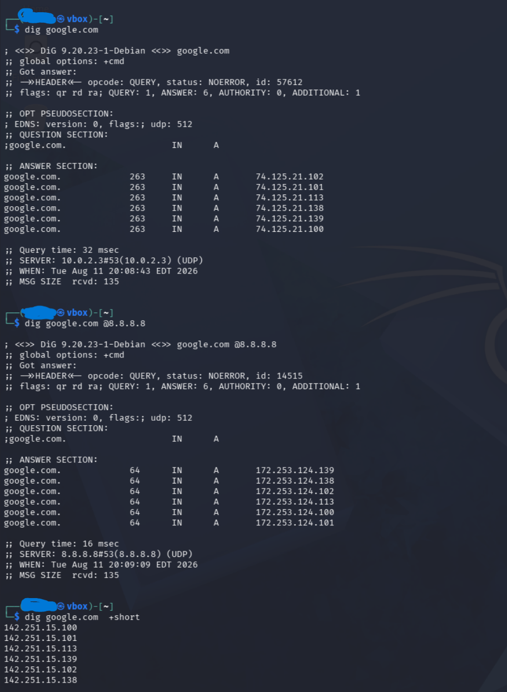
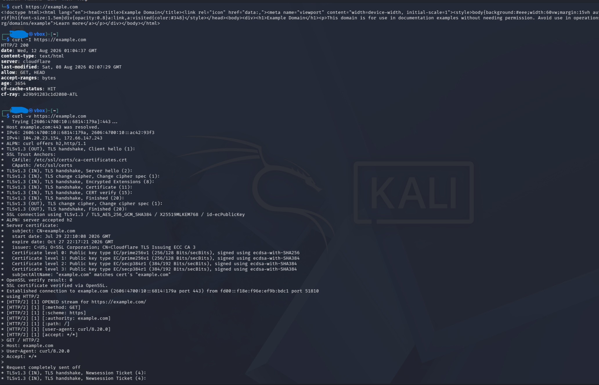
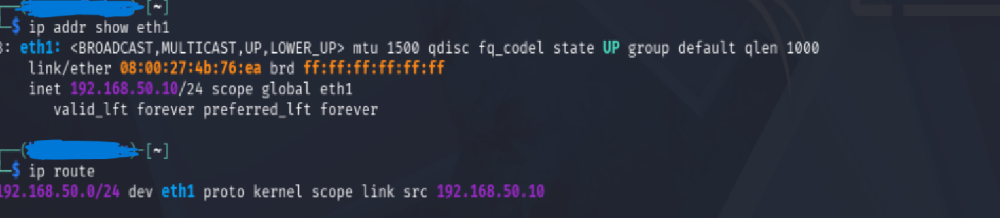
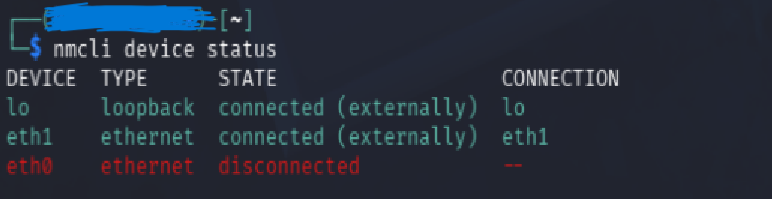
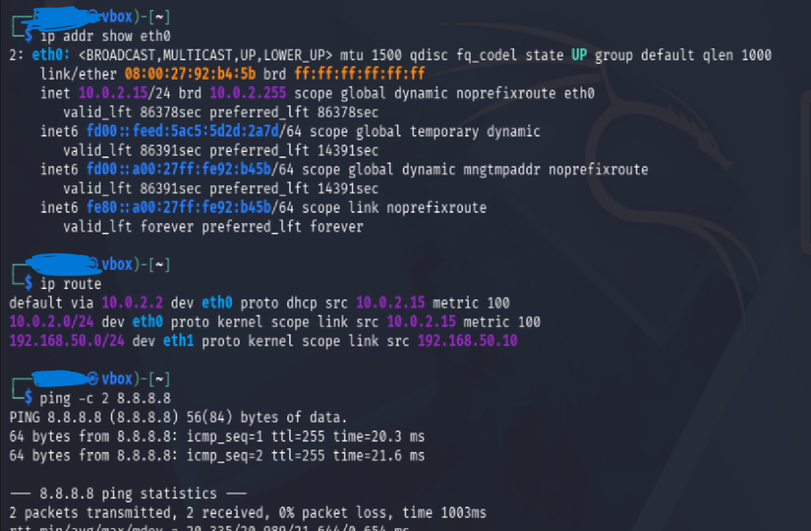
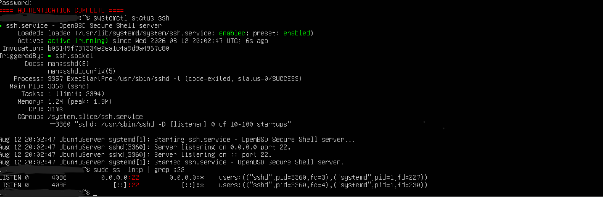

# Lab: Network Information Gathering & Connectivity Troubleshooting

## Overview

The purpose of this lab is to demonstrate hands-on Linux networking and troubleshooting using Kali Linux and Ubuntu Server in VirtualBox.

I configured a dual-network virtual environment, examined IP configuration and routing, tested ICMP connectivity, investigated DNS resolution, analyzed HTTP/HTTPS connections, configured SSH remote administration, and diagnosed multiple network/service failures.

## Skills Demonstrated

- Linux network configuration
- IPv4 addressing and CIDR
- Routing and default gateway analysis
- ICMP connectivity testing
- DNS troubleshooting
- HTTP/HTTPS connectivity testing
- TCP port and socket analysis
- SSH remote administration
- SSH host verification
- Linux service troubleshooting
- Structured network troubleshooting

## Lab Environment

| System | Interface | Purpose | Address |
|---|---|---|---|
| Kali Linux | `eth0` | VirtualBox NAT / Internet | DHCP |
| Kali Linux | `eth1` | Private lab network | `192.168.50.10/24` |
| Ubuntu Server | `enp0s3` | VirtualBox NAT / Internet | DHCP |
| Ubuntu Server | `enp0s8` | Private lab network | `192.168.50.20/24` |

### Network Architecture

```text
                         Internet
                            |
                     VirtualBox NAT
                       /          \
                  Kali             Ubuntu
                  eth0             enp0s3
                    |                 |
             +------+-----------------+------+
             |        Private Lab Network    |
             |         192.168.50.0/24       |
             +------+-----------------+------+
                    |                 |
                   eth1             enp0s8
             192.168.50.10      192.168.50.20
```

The NAT interfaces provide Internet connectivity while the private `192.168.50.0/24` network provides an isolated environment for communication between Kali Linux and Ubuntu Server.

---

# 1. Network Information Gathering

I began by examining Kali Linux's network configuration.

Commands included:

```bash
ip addr
ip route
cat /etc/resolv.conf
```

These commands allowed me to identify:

- Interface addresses
- CIDR prefixes
- Default gateway
- Directly connected networks
- DNS resolver configuration



The initial Kali NAT interface received its configuration through DHCP. The routing table identified the default gateway used for destinations outside directly connected networks.
This established a baseline before performing additional connectivity testing.


# 2. ICMP Connectivity Testing

I used `ping` to progressively test different parts of the network path.

```bash
ping -c 4 127.0.0.1
ping -c 4 10.0.2.2
ping -c 4 8.8.8.8
ping -c 4 google.com
```



Each test answered a different troubleshooting question.

| Test | Purpose |
|---|---|
| `127.0.0.1` | Test the local TCP/IP stack |
| Default gateway | Test connectivity to the local gateway |
| `8.8.8.8` | Test external IP connectivity without depending on DNS |
| `google.com` | Test connectivity while also requiring hostname resolution |

A successful ping demonstrates ICMP/IP reachability, but it does not prove that an application or TCP service is functioning.

I also learned to interpret common ping output including:

- `icmp_seq` — ICMP sequence number
- `ttl` — remaining IP Time To Live
- `time` — round-trip response time
- packet loss — percentage of probes without replies


# 3. DNS Investigation

I investigated DNS resolution using both `nslookup` and `dig`.

Examples included:

```bash
nslookup google.com
nslookup google.com 8.8.8.8

dig google.com
dig google.com @8.8.8.8
dig google.com +short
```



Querying both the configured DNS resolver and a known external resolver demonstrated how alternate resolvers can help isolate DNS problems.For example, if a hostname fails through the configured resolver but succeeds when explicitly querying another resolver, the evidence points toward a DNS resolver/configuration problem rather than general Internet connectivity.

# 4. Network Path Analysis

I used `traceroute` to investigate the Layer 3 path toward a destination.

Examples included:

```bash
traceroute google.com
sudo traceroute -I 8.8.8.8
sudo traceroute -T -p 443 google.com
```
Traceroute uses TTL behavior to identify Layer 3 devices along a network path.

I also learned that:

```text
* * *
```

does not automatically mean a destination is unreachable.
A router or security device may not return the expected traceroute response because of filtering, configuration, rate limiting, or other network behavior.
When testing Kali and Ubuntu on the same `192.168.50.0/24` network, no router was required between the systems because they were directly connected.


# 5. HTTP and HTTPS Testing

I used `curl` to move beyond basic connectivity testing and interact with an actual application-layer protocol.

Examples included:

```bash
curl https://example.com
curl -I https://example.com
curl -v https://example.com
```



The verbose output allowed me to examine information including:

- DNS resolution
- Destination IP
- TCP connection
- HTTP protocol
- HTTP status
- TLS negotiation
- Certificate information

This demonstrated an important troubleshooting distinction:

```text
Successful ping
       ≠
Successful web application connection
```

ICMP can succeed while an HTTP/HTTPS service is unavailable.
I also compared HTTP and HTTPS behavior and observed that HTTP commonly uses TCP/80 while HTTPS commonly uses TCP/443 and adds TLS encryption and certificate validation.


# 6. Building a Private Client/Server Network

I expanded the lab by adding an Ubuntu Server VM.

A second VirtualBox network adapter was configured on each VM to create an isolated private network.

```text
Network: 192.168.50.0/24

Kali:
192.168.50.10/24

Ubuntu:
192.168.50.20/24
```



Because both addresses belong to the same subnet, Kali and Ubuntu can communicate directly without a router between them.
The NAT interfaces remained available separately for Internet connectivity.
I later configured these private addresses persistently using:

- NetworkManager on Kali
- Netplan on Ubuntu Server

The persistent configuration was verified by rebooting the systems and confirming that the addresses and connectivity returned automatically.


# 7. Troubleshooting Scenario — Lost Internet Connectivity

While configuring Kali's second network interface, I encountered an unexpected connectivity failure.

## Symptom

An external connectivity test returned:

```bash
ping -c 2 8.8.8.8
```

```text
Network is unreachable
```



Rather than assuming that the Internet connection or remote destination was unavailable, I examined the local networking configuration.

## Investigation

I checked:

```bash
ip route
ip addr show eth0
nmcli device status
nmcli connection show
```

The investigation showed that:

1. The routing table did not contain a default route.
2. The NAT interface did not have its expected IPv4 configuration.
3. NetworkManager showed `eth0` as disconnected.
4. An existing NetworkManager connection profile was still present.

This created the following troubleshooting path:

```text
External connectivity fails
        |
        v
Inspect routing table
        |
        v
Default route missing
        |
        v
Inspect NAT interface
        |
        v
Expected IPv4 configuration missing
        |
        v
Inspect NetworkManager
        |
        v
eth0 disconnected
        |
        v
Existing connection profile identified
        |
        v
Connection restored
```

After restoring the NetworkManager connection, DHCP configuration and the default route returned.

## Verification



The routing table once again contained:

- The NAT network
- The private `192.168.50.0/24` network
- A default route through the NAT interface

A subsequent ping to `8.8.8.8` succeeded.

### Lesson

An interface being administratively **UP** does not necessarily mean that it has usable Layer 3 configuration.

`Network is unreachable` can indicate a local routing problem before packets ever leave the system.


# 8. SSH Remote Administration

After establishing connectivity between Kali and Ubuntu, I configured SSH remote administration.

The initial SSH attempt resulted in a connection refusal.

I investigated whether Ubuntu was actually providing an SSH service rather than assuming the network was broken.

The server initially had the OpenSSH client installed but did not have a server listening on port 22.

After configuring OpenSSH Server, I verified the service using:

```bash
systemctl status ssh
sudo ss -lntp | grep :22
```



The results confirmed that:

- `ssh.service` was active
- `sshd` was running
- TCP port 22 was listening

I then successfully established an SSH connection from Kali to Ubuntu.


## SSH Host Verification

During the first SSH connection, the client presented the Ubuntu server's ED25519 host-key fingerprint.

Rather than treating this message as user authentication, I learned that SSH host-key verification answers a different security question:

> Am I connecting to the server I expect to be connecting to?

Once trusted, SSH stores host information in:

```bash
~/.ssh/known_hosts
```

User authentication then occurs separately.

---

## Examining the SSH Connection

I examined the established TCP session and identified the connection endpoints.

Conceptually:

```text
Kali
192.168.50.10:<ephemeral-port>
             |
             | TCP
             v
Ubuntu
192.168.50.20:22
```

This reinforced the TCP connection **4-tuple**:

```text
Source IP
Source Port
Destination IP
Destination Port
```

The SSH server listens on the well-known TCP port 22 while the client generally uses a temporary ephemeral source port.

I also examined the associated Linux processes and used PID and PPID information to understand parent/child relationships between SSH processes.


# 9. Last Troubleshooting Challenge

## Scenario

An internal web application hosted at:

```text
192.168.50.20
```

was reported unavailable over:

```text
HTTP / TCP 80
```

The objective was to determine whether the problem was caused by:

- Network connectivity
- Routing
- Application/service availability

## Step 1 — Test Host Connectivity

From Kali:

```bash
ping -c 4 192.168.50.20
```

The ping succeeded.

### Finding

Basic IP connectivity existed between Kali and Ubuntu.

However, this did **not** prove that the web application itself was functioning.

## Step 2 — Test the Actual Application Service

I then tested HTTP directly:

```bash
curl -v http://192.168.50.20
```

The connection was refused.

### Finding

The server was reachable, but TCP port 80 was not accepting the HTTP connection.

This narrowed the investigation from general network connectivity toward service availability.


## Step 3 — Examine Listening Services

On Ubuntu, I examined listening TCP sockets:

```bash
sudo ss -lntp
```

SSH was listening on TCP/22, but no service was listening on TCP/80.

Further service/package investigation confirmed that there was no web server providing the expected HTTP service.


## Root Cause

The evidence isolated the failure to **application/service availability rather than basic network connectivity or routing**.

The troubleshooting sequence was:

```text
Web application unavailable
          |
          v
Can I reach the server?
          |
        YES
          |
          v
Can I connect to HTTP/TCP 80?
          |
         NO
          |
          v
Is anything listening on TCP/80?
          |
         NO
          |
          v
Service availability problem identified
```

---

# Lessons Learned
- Successful ICMP connectivity does not prove an application is functioning.
- An interface can be UP while still lacking usable Layer 3 configuration.
- Routing tables are critical when diagnosing `Network is unreachable`.
- DNS failures should be separated from general IP connectivity problems.
- `Connection refused` provides different evidence from an unreachable network or timeout.
- Devices on the same subnet can communicate directly without routing through a gateway.


# Tools Used
| Tool | Purpose |
|---|---|
| `ip addr` | Interface and IP configuration |
| `ip route` | Routing table analysis |
| `ping` | ICMP/IP connectivity testing |
| `nslookup` | DNS resolution testing |
| `dig` | Detailed DNS investigation |
| `traceroute` | Network path investigation |
| `curl` | HTTP/HTTPS application testing |
| `ss` | Socket, port and connection analysis |
| `ssh` | Secure remote administration |
| `nmcli` | NetworkManager configuration/troubleshooting |
| Netplan | Persistent Ubuntu network configuration |
| `systemctl` | Linux service investigation |
| `dpkg` | Package investigation |


## Key Takeaway

This lab reinforced that effective network troubleshooting is not about memorizing commands.

It is about using each tool to gather evidence, narrowing the scope of a problem, and determining whether a failure originates from addressing, routing, name resolution, transport connectivity, or application/service availability.
